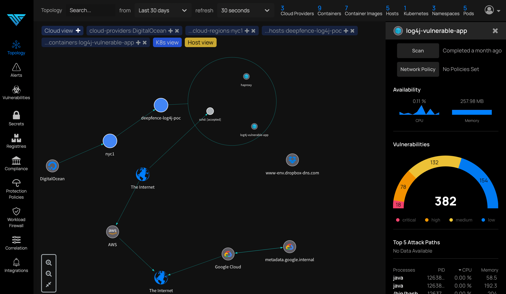
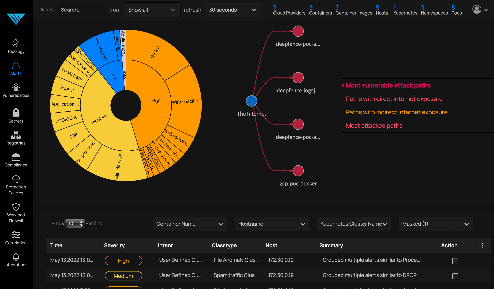
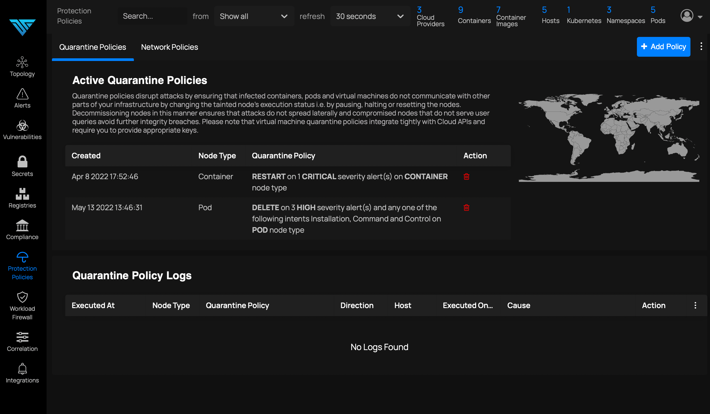

# Deepfence ThreatStryker

[Deepfence ThreatStryker](https://deepfence.io/threatstryker/) observes, correlates, learns, and acts to protect your cloud-native applications, across clouds and on-prem locations.

ThreatStryker supports applications running in cloud-native platforms (kubernetes, serverless, docker) and virtual machines/bare metal, across multiple clouds and on-prem locations.

 * ThreatStryker discovers all running containers, processes, and online hosts, and presents a live and interactive color-coded view of the topology. It audits containers and hosts to detect vulnerable components, and interrogates configuration to identify file system, process, and network related misconfigurations. ThreatStryker assesses compliance using industry and community standard benchmarks.

 * ThreatStryker performs deep inspection of network traffic, system, and application behavior, and accumulates suspicious events over time. Events are classified and correlated against known vulnerabilities and suspicious patterns of behavior, in order to detect active threats with minimal false positives.

 * If suspicious patterns of behavior are detected, the intent of the behavior is deduced and ThreatStryker takes appropriate and contained remedial action. Tainted workloads are deleted, frozen, or restarted, sources of attack traffic are temporarily or permanently blocked, and alerts are raised to SIEM and monitoring systems. Attackers are stopped in their tracks, attacks are neutralized, and lateral spread is prevented.

## ThreatStryker and ThreatMapper

ThreatStryker builds on the functionality of the open-source [ThreatMapper](https://github.com/deepfence/ThreatMapper/) security platform:

* [ThreatMapper](https://github.com/deepfence/ThreatMapper/) identifies security risks - software vulnerabilities, exposed secrets - in your production platforms, and prioritizes them so you know which to fix first
* [ThreatStryker](https://deepfence.io/threatstryker) observes network traffic and application behavior relating to both known (discovered by ThreatMapper) and unknown (zero-day or app-specific) risks, identifies ongoing attacks and provides automated and guided protection to prevent attacks from spreading

Use ThreatMapper to find risks in your production platforms, and ThreatStryker to observe attack behavior and secure against exploit.